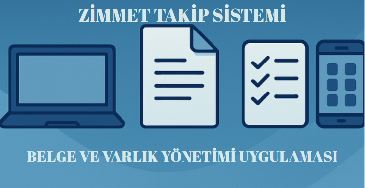
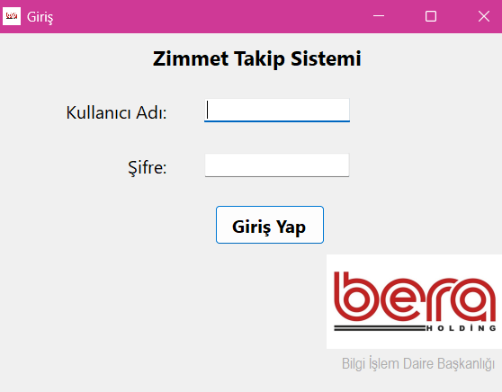
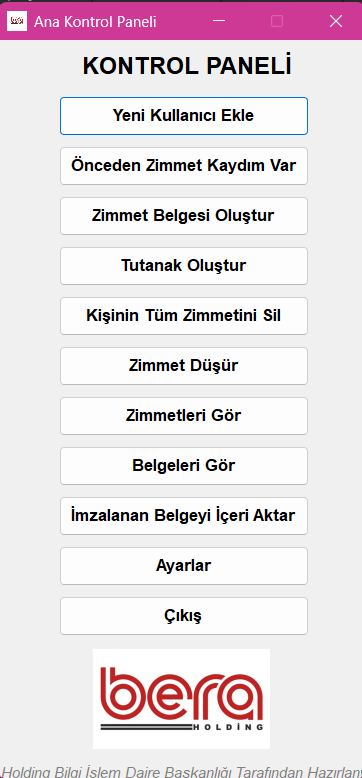
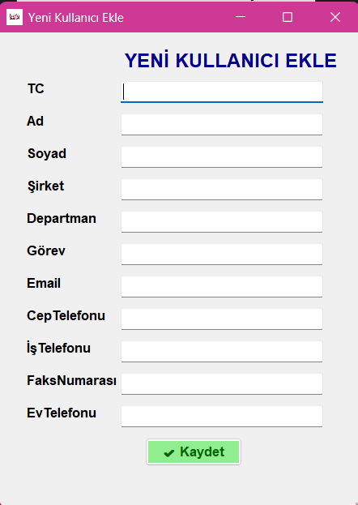
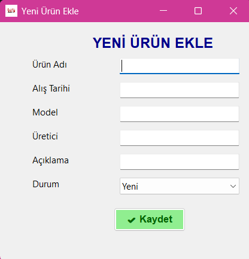
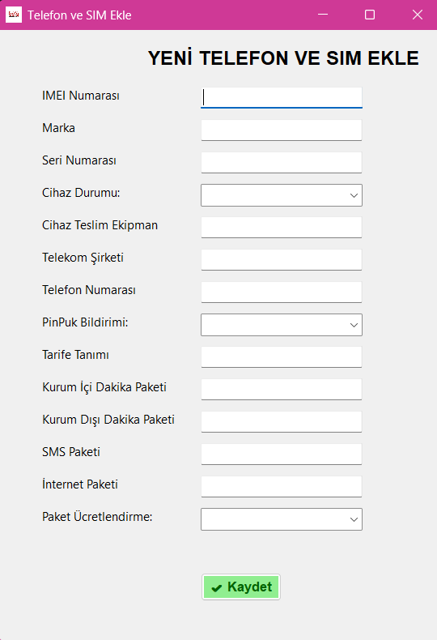
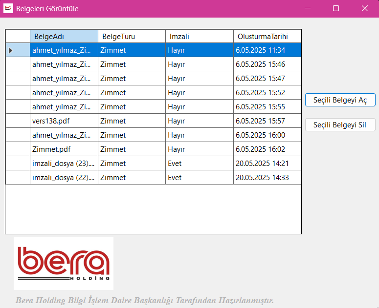
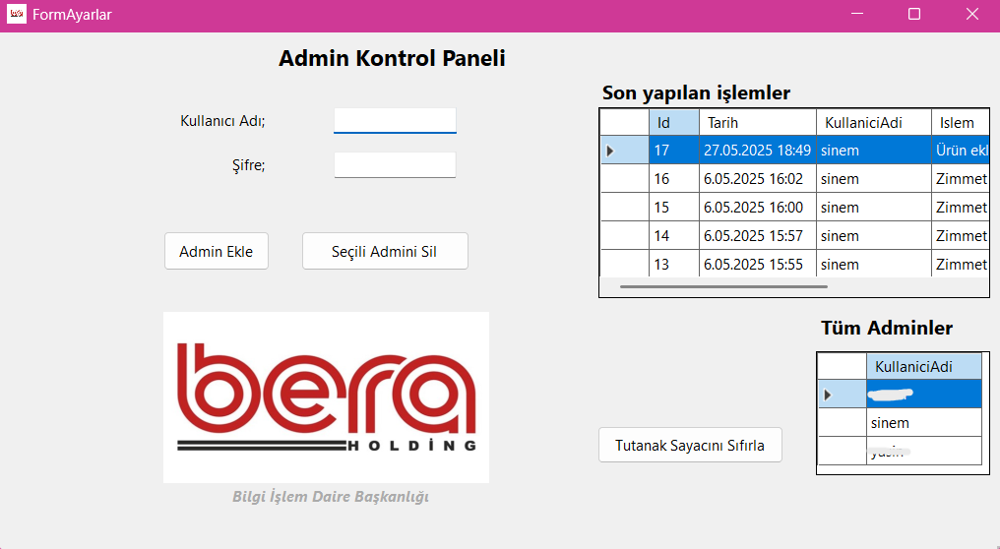

# 🧾 Zimmet Takip ve Belge Yönetim Uygulaması

Kurumsal varlıkların (telefon, sim kart, cihaz, vb.) zimmetlenmesi, takibi ve belge yönetimi için geliştirilmiş bir Windows Forms uygulamasıdır.

> Bu uygulama **Bera Holding Bilgi İşlem Daire Başkanlığı** için, **tek kişi tarafından** staj projesi kapsamında geliştirilmiştir.

---

## 🚀 Uygulama Özellikleri

- 👤 Kullanıcı yönetimi (yeni kullanıcı ekleme, bilgilerini görme)
- 📦 Ürün zimmetleme ve düşürme (telefon, sim, diğer cihazlar)
- 📄 Zimmet belgesi ve tutanak oluşturma (PDF formatında)
- 🗂️ Belge listeleme ve imzalı belge içeri aktarma
- 🔐 Admin yönetimi, log görüntüleme ve tutanak sıfırlama
- 🎨 Gelişmiş kullanıcı arayüzü, responsive kontroller

---

## 📁 Proje Yapısı

| Form / Sınıf             | Açıklama                                 |
|--------------------------|------------------------------------------|
| `Form1.cs`               | Ana kontrol paneli                       |
| `Form2.cs`               | Yeni kullanıcı ekleme                    |
| `Form3.cs`               | Yeni ürün ekleme                         |
| `Form4.cs`               | Telefon ve SIM bilgisi ekleme            |
| `Form5.cs`               | Zimmet düşürme ekranı                    |
| `Form6.cs`               | Tutanak oluşturma arayüzü                |
| `Form7.cs`               | Kişinin tüm zimmetlerini görme          |
| `FormAyarlar.cs`         | Admin, log ve sistem yönetimi            |
| `BelgeOlustur.cs`        | iText7 ile PDF belge oluşturma          |
| `BelgeGoruntule.cs`      | Veritabanındaki belgeleri listeleme      |

---

## ✅ Gereksinimler

- Visual Studio 2022+
- .NET 6 veya üzeri
- SQL Server (Express veya tam sürüm)
- Gerekli NuGet Paketleri:
  - `Microsoft.Data.SqlClient`
  - `iText7`
  - `System.Configuration.ConfigurationManager`

---

## 🔧 Veritabanı Kurulumu (ZimmetDB)

### 1. Veritabanını Oluştur

```sql
CREATE DATABASE ZimmetDB;
GO
```

### 2. Tabloları Oluştur

📄 Proje dizininde bulunan `update_commands.sql` dosyasını SSMS üzerinden çalıştır:

```sql
USE ZimmetDB;
GO

-- Admin tablosu örnek:
CREATE TABLE dbo.Adminler (
    Id INT PRIMARY KEY IDENTITY(1,1),
    KullaniciAdi NVARCHAR(50) NOT NULL,
    Sifre NVARCHAR(100) NOT NULL
);
```

> `update_commands.sql` dosyası uygulamaya ait tüm tablo ve kısıtları otomatik olarak oluşturur.

---

## ⚙️ App.config SQL Bağlantısı

`App.config` dosyanıza aşağıdaki bağlantıyı ekleyin:

```xml
<configuration>
  <connectionStrings>
    <add name="ZimmetDB"
         connectionString="Server=.;Database=ZimmetDB;Trusted_Connection=True;"
         providerName="System.Data.SqlClient"/>
  </connectionStrings>
</configuration>
```

📝 `. (nokta)` yerel SQL Server’ı temsil eder. İhtiyacınıza göre değiştirebilirsiniz (`localhost`, `SQLEXPRESS` vs.).

---

## ▶️ Uygulama Çalıştırma Adımları

1. Visual Studio’da `ZWebApp.sln` çözümünü aç.
2. Gerekli NuGet paketlerini yükle (`iText7`, `SqlClient`, `System.Configuration.ConfigurationManager`).
3. `App.config` içinde bağlantı dizesini kontrol et.
4. `ZimmetDB` veritabanı tanımlı olmalı ve tablolar kurulu olmalı.
5. Başlangıç formu `Form1.cs` olarak tanımlıdır.
6. Derle (`Ctrl + Shift + B`) ve çalıştır (`F5`).

---

## 🔄 Veritabanını Sıfırlama (Opsiyonel)

Tüm verileri sıfırlamak için aşağıdaki SQL komutlarını çalıştırabilirsiniz:

```sql
-- Tüm foreign key kısıtlamalarını devre dışı bırak
EXEC sp_MSForEachTable 'ALTER TABLE ? NOCHECK CONSTRAINT ALL';

-- Tüm verileri sil
EXEC sp_MSForEachTable 'DELETE FROM ?';

-- Kısıtlamaları tekrar aktif hale getir
EXEC sp_MSForEachTable 'ALTER TABLE ? CHECK CONSTRAINT ALL';

-- Ürün ID arttırıcısını sıfırla
DBCC CHECKIDENT ('Ürünler', RESEED, 0);
```

---

## 🖼️ Ekran Görüntüleri


### Giriş Ekranı


### Ana Kontrol Paneli


### Yeni Kullanıcı Ekleme


### Yeni Ürün Ekleme


### Yeni Telefon Ekleme


### Belgeleri Görüntüleme


### Admin Paneli
 (Opsiyonel)

> Ekran görüntüleri veya animasyonlar `.gif` formatında bu bölüme eklenebilir.

---

## 👨‍💻 Geliştirici

**[Sinem Naz İNAN]**  
📍IT Department Intern  
📅 2025
---

## ⚠️ Lisans

Bu proje yalnızca eğitim ve kurumsal iç kullanım için hazırlanmıştır.

---


# 🧾 Asset Tracking and Document Management Application

This is a Windows Forms application developed for managing institutional asset assignments (phones, SIM cards, devices, etc.) and document workflows.

> Developed as a **solo internship project** for **Bera Holding IT Department**.

---

## 🚀 Features

- 👤 User management (add/view users)
- 📦 Product assignment & return tracking (phones, SIMs, devices)
- 📄 Generate delivery documents & reports as PDF
- 🗂️ View and import signed PDF documents
- 🔐 Admin panel, logs, and document reset functionality
- 🎨 Responsive and user-friendly interface

---

## 📁 Project Structure

| Form / Class            | Description                               |
|-------------------------|-------------------------------------------|
| `Form1.cs`              | Main control panel                        |
| `Form2.cs`              | Add new user                              |
| `Form3.cs`              | Add new product                           |
| `Form4.cs`              | Add phone and SIM details                 |
| `Form5.cs`              | Unassign product screen                   |
| `Form6.cs`              | Create incident report (PDF)              |
| `Form7.cs`              | List all user assignments                 |
| `FormAyarlar.cs`        | Admin and system settings                 |
| `BelgeOlustur.cs`       | Generate PDF documents via iText7         |
| `BelgeGoruntule.cs`     | View and manage stored documents          |

---

## ✅ Requirements

- Visual Studio 2022+
- .NET 6 or later
- SQL Server (Express or full edition)
- Required NuGet Packages:
  - `Microsoft.Data.SqlClient`
  - `iText7`
  - `System.Configuration.ConfigurationManager`

---

## 🔧 Database Setup (ZimmetDB)

### 1. Create Database

```sql
CREATE DATABASE ZimmetDB;
GO
```

### 2. Create Tables

Run the `update_commands.sql` file using SSMS:

```sql
USE ZimmetDB;
GO

-- Sample table:
CREATE TABLE dbo.Adminler (
    Id INT PRIMARY KEY IDENTITY(1,1),
    KullaniciAdi NVARCHAR(50) NOT NULL,
    Sifre NVARCHAR(100) NOT NULL
);
```

> This script creates all tables and constraints required by the system.

---

## ⚙️ SQL Connection in App.config

Add the following connection string to `App.config`:

```xml
<configuration>
  <connectionStrings>
    <add name="ZimmetDB"
         connectionString="Server=.;Database=ZimmetDB;Trusted_Connection=True;"
         providerName="System.Data.SqlClient"/>
  </connectionStrings>
</configuration>
```
## 🖼️ Screenshots

### Login Screen


### Main Control Panel


### Add New User


### Add New Product


### Add Phone and SIM


### View Documents


### Admin Panel

---

## ▶️ Run Instructions

1. Open `ZWebApp.sln` in Visual Studio.
2. Install required NuGet packages.
3. Verify `App.config` connection string.
4. Make sure `ZimmetDB` exists and tables are initialized.
5. Set `Form1.cs` as the startup form.
6. Build (`Ctrl + Shift + B`) and run (`F5`).

---

## 🔄 Optional: Reset Database

Use the following SQL commands:

```sql
EXEC sp_MSForEachTable 'ALTER TABLE ? NOCHECK CONSTRAINT ALL';
EXEC sp_MSForEachTable 'DELETE FROM ?';
EXEC sp_MSForEachTable 'ALTER TABLE ? CHECK CONSTRAINT ALL';
DBCC CHECKIDENT ('Ürünler', RESEED, 0);
```

---

## 👨‍💻 Developer

**[Sinem Naz İNAN]**  
📍IT Department Intern  
📅 2025

---

## ⚠️ License

This project is for educational and internal enterprise use only.
